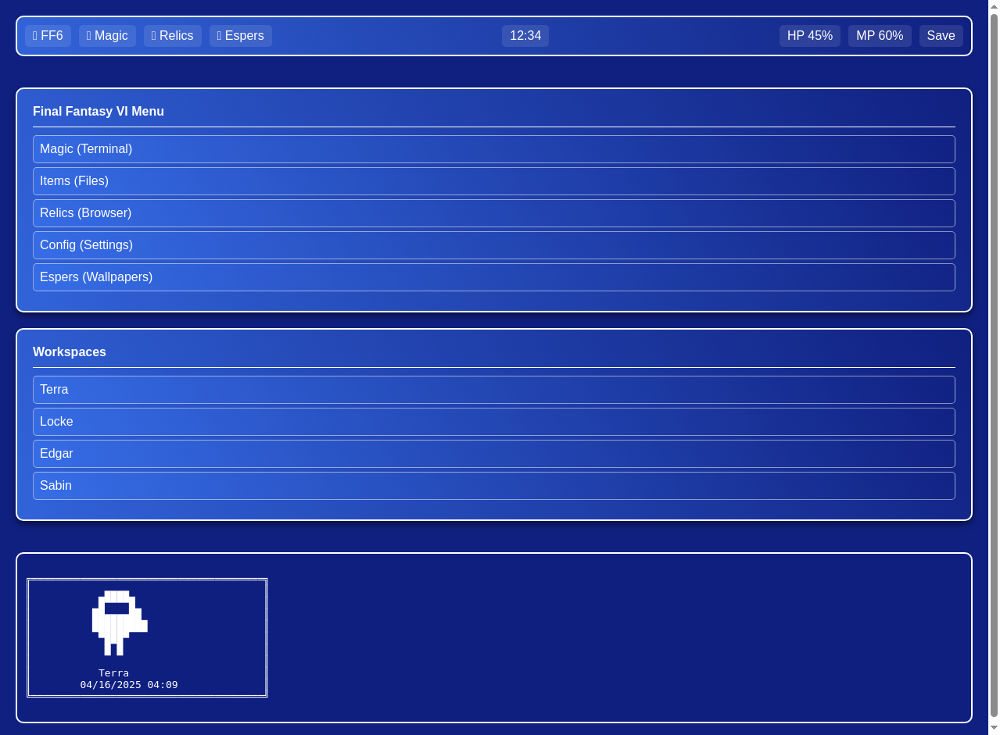

# Final Fantasy VI Themed Hyprland Configuration

A comprehensive Hyprland configuration with a Final Fantasy VI menu-inspired theme featuring blue gradients with white borders, FF6 character sprites, and the Atma Weapon cursor.



## Features

- **FF6 Menu Style Theme**: Blue gradient backgrounds with white borders across all UI elements
- **FF6 Character Sprites**: Random FF6 character sprite display in terminal
- **Atma Weapon Cursor**: Custom cursor from FF6
- **FF6 Sound Effects**: Authentic FF6 cursor sounds for notifications and FF6 menu confirm sounds for interactions
- **FF6 Terminology**: Waybar elements renamed to match FF6 game terms (Magic, Items, Relics, etc.)
- **Paired Function Icons**: Each icon handles two functions (left/right click)
- **Responsive Design**: Works across resolutions from 1080p to 4K
- **Consistent Theming**: All applications follow the FF6 aesthetic

## Components

- **Hyprland**: Window manager with animations and keybindings
- **Waybar**: Top and bottom bars with FF6-themed elements
- **Rofi**: Application launcher with FF6 menu style
- **Kitty**: Terminal with FF6 character sprites
- **SwayNC**: Notifications with FF6 styling
- **GTK/Qt Theming**: Consistent FF6 theme across all applications

## Installation

1. Clone this repository to your local machine:
   ```bash
   git clone https://github.com/yourusername/ff6-hyprland-config.git
   ```

2. Copy the configuration files to your Hyprland config directory:
   ```bash
   mkdir -p ~/.config/hypr
   cp -r ff6-hyprland-config/* ~/.config/hypr/
   ```

3. Install required dependencies:
   ```bash
   # For Arch Linux
   yay -S hyprland waybar rofi-wayland kitty kvantum nwg-look swappy swww cliphist swaync swaybg wallust gtk-engine-murrine
   ```

4. Set up the Atma Weapon cursor:
   ```bash
   ~/.config/hypr/scripts/create-atma-cursor.sh
   ```

5. Log out and log back in to Hyprland to apply the configuration.

## Keybindings

- **Super + Enter**: Open terminal (Magic)
- **Super + E**: Open file manager (Items)
- **Super + D**: Open application launcher (Rofi)
- **Super + NUM**: Switch to workspace
- **Super + Shift + NUM**: Move window to workspace

## Waybar Shortcuts

### Top Bar
- **FF6 Logo**: Left click for app menu, right click for window overview
- **Magic/Items**: Left click for terminal, right click for file manager
- **Relics/Config**: Left click for browser, right click for theme settings
- **Espers/Wallpaper**: Left click for wallpaper menu, right click for random wallpaper
- **Save/Lock**: Left click for power menu, right click to lock screen

### Bottom Bar
- **Character Names**: Workspaces named after FF6 characters
- **Chocobo/Magitek**: Network connections

## Customization

### Changing Wallpapers
Use the Espers menu in the top bar or run:
```bash
~/.config/hypr/scripts/wallpaper-menu.sh
```

### Switching Between Light/Dark Theme
Click the Config icon in the top bar or run:
```bash
~/.config/hypr/scripts/theme-toggle.sh
```

## Credits

- Final Fantasy VI is property of Square Enix
- Fonts: JetBrains Mono Nerd, Victor Mono, and Fantastique Sans Mono Nerd
- Special thanks to the Hyprland community

## License

This configuration is provided under the MIT License. See the LICENSE file for details.
