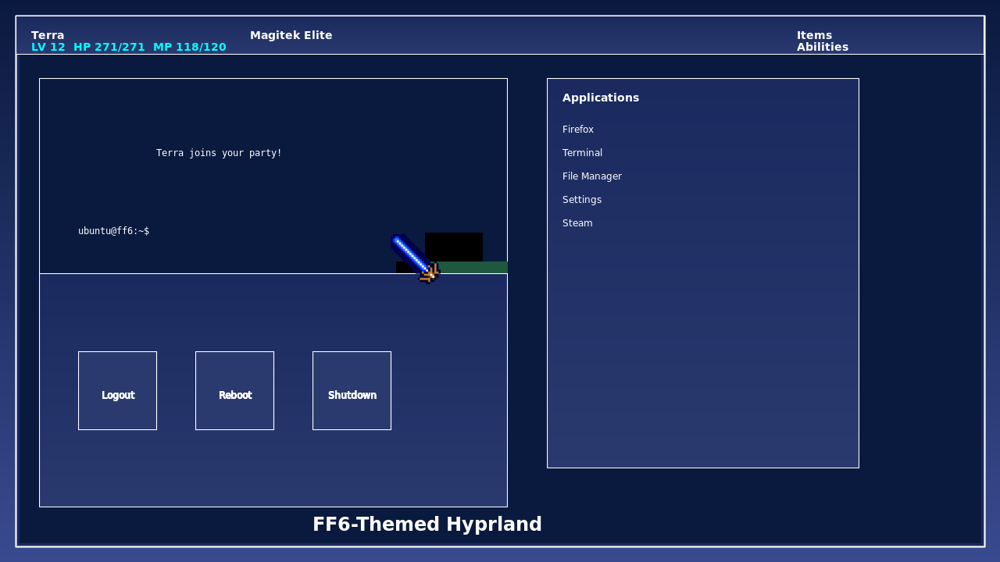

# FF6-Themed Hyprland Configuration

A comprehensive Final Fantasy VI-themed configuration for Hyprland, featuring authentic FF6 styling, character sprites, sound effects, and more.



## Features

- **Authentic FF6 Styling**: Blue gradient backgrounds with pixel patterns and white borders matching the original game's menu system
- **Character Sprites**: Terminal displays FF6 character sprites (Terra, Locke, Edgar, etc.)
- **FF6 Sound Effects**: Menu sounds, cursor movements, and notifications use FF6-style sound effects
- **Ultima Weapon Cursor**: Custom cursor theme featuring the Ultima Weapon sword from FF6
- **Themed Components**: All major components (waybar, rofi, wlogout, etc.) styled to match FF6 aesthetics
- **Comprehensive Installer**: Easy installation with automatic dependency handling

## Installation

1. Clone the repository:
   ```bash
   git clone https://github.com/yourusername/ff6-hyprland.git
   cd ff6-hyprland
   ```

2. Run the installer script:
   ```bash
   ./install.sh
   ```

3. Log out and select Hyprland from your display manager.

## Components

### Waybar

The waybar configuration features FF6-style character stats and menu options:

- **Character Stats**: System monitors displayed as FF6 character stats (CPU, memory, disk usage)
- **Menu Options**: Right-side menu with FF6-style options (Items, Abilities, Equip, etc.)
- **FF6 Styling**: Authentic FF6 blue gradient background with white borders

### Terminal (Kitty)

The kitty terminal configuration includes:

- **FF6 Character Sprites**: Displays FF6 character sprites when opening a terminal
- **FF6 Color Scheme**: Terminal colors match the FF6 color palette
- **Custom Font**: Pixel-perfect font for authentic FF6 feel

### Rofi Launcher

The rofi launcher is styled to match FF6 menus:

- **FF6 Menu Design**: Blue gradient background with white borders
- **Pixel Font**: Authentic FF6-style pixel font
- **Menu Sounds**: FF6 menu sound effects when navigating

### Cursor Theme

Custom cursor theme featuring FF6 weapons:

- **Ultima Weapon**: Main cursor uses the Ultima Weapon sprite
- **FF6 Cursor**: Text input cursor uses the FF6 text cursor

### Wlogout

The logout screen is styled after FF6 battle menus:

- **FF6 Battle Menu**: Styled after the FF6 battle command menu
- **Character Portraits**: Displays FF6 character portraits
- **FF6 Sound Effects**: Plays FF6 sound effects when selecting options

## Keybindings

| Key Combination | Action |
|-----------------|--------|
| Super + Return | Open terminal |
| Super + Q | Close active window |
| Super + Space | Open application launcher |
| Super + E | Open file manager |
| Super + F | Toggle fullscreen |
| Super + V | Toggle floating window |
| Super + Tab | Cycle through windows |
| Super + [1-9] | Switch to workspace |
| Super + Shift + [1-9] | Move window to workspace |
| Super + Alt + L | Lock screen |
| Super + Alt + E | Exit Hyprland |

## Customization

You can customize various aspects of the theme by editing the configuration files:

- **Colors**: Edit `~/.config/hypr/colors.conf`
- **Wallpapers**: Replace wallpapers in `~/.config/hypr/wallpapers/`
- **Sound Effects**: Replace sound files in `~/.config/hypr/sounds/`
- **Character Sprites**: Replace sprite images in `~/.config/sprites/`

## Troubleshooting

If you encounter any issues:

1. Check the error log: `~/.config/hypr/hyprland.log`
2. Run the validation script: `~/.config/hypr/scripts/validate-config.sh`
3. Fix common issues: `~/.config/hypr/scripts/fix-configurations.sh`

## Credits

This project incorporates and adapts components from various sources:

### Core Components
- **Hyprland**: [Hyprland](https://github.com/hyprwm/Hyprland) - A dynamic tiling Wayland compositor
- **JaKooLit's Hyprland-Dots**: [JaKooLit/Hyprland-Dots](https://github.com/JaKooLit/Hyprland-Dots) - Base configuration structure and scripts
- **Waybar**: [Alexays/Waybar](https://github.com/Alexays/Waybar) - Highly customizable Wayland bar

### FF6 Resources
- **Final Fantasy VI**: All Final Fantasy VI characters, sprites, and styling are property of Square Enix
- **FF6 Sprites**: Character sprites adapted from [Final Fantasy Wiki](https://finalfantasy.fandom.com/wiki/Final_Fantasy_VI)
- **Ultima Weapon Cursor**: Based on the Ultima Weapon sprite from Final Fantasy VI
- **FF6 Sound Effects**: Generated to mimic the original game's sound effects

### Additional Resources
- **Wallust**: [Wallust](https://github.com/anufrievroman/Wallust) - Color scheme generator
- **Pokemon Color Scripts**: [Pokemon-colorscripts](https://gitlab.com/phoneybadger/pokemon-colorscripts) - Inspiration for terminal character display
- **Kitty Terminal**: [Kitty](https://github.com/kovidgoyal/kitty) - Terminal emulator
- **Rofi**: [Rofi](https://github.com/davatorium/rofi) - Application launcher
- **Wlogout**: [Wlogout](https://github.com/ArtsyMacaw/wlogout) - Wayland logout menu

### Fonts
- **JetBrains Mono**: [JetBrains Mono](https://www.jetbrains.com/lp/mono/)
- **Victor Mono**: [Victor Mono](https://rubjo.github.io/victor-mono/)
- **Fantasque Sans Mono**: [Fantasque Sans Mono](https://github.com/belluzj/fantasque-sans)

### Inspiration
- **r/unixporn**: Various FF6-themed setups on [r/unixporn](https://www.reddit.com/r/unixporn/)
- **FF6 UI Design**: Original game UI design by Square (now Square Enix)

## License

This project is licensed under the MIT License - see the [LICENSE](LICENSE) file for details.

## Disclaimer

Final Fantasy VI and all related characters, images, and sounds are property of Square Enix. This project is a fan creation and is not affiliated with or endorsed by Square Enix.
